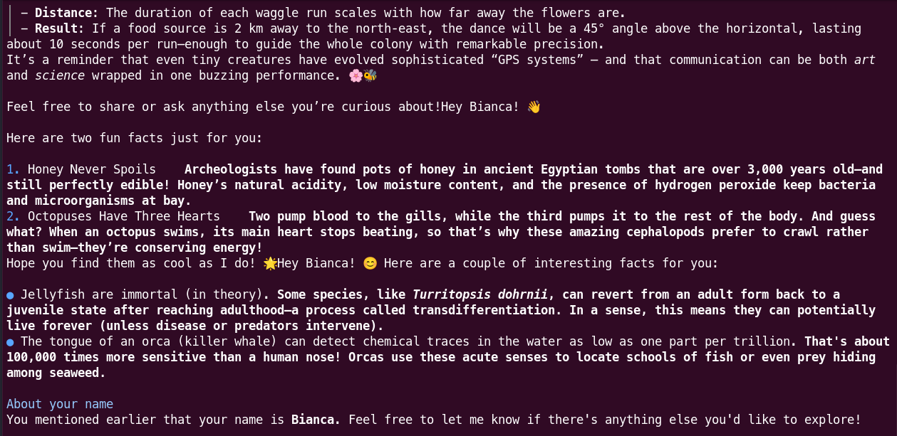
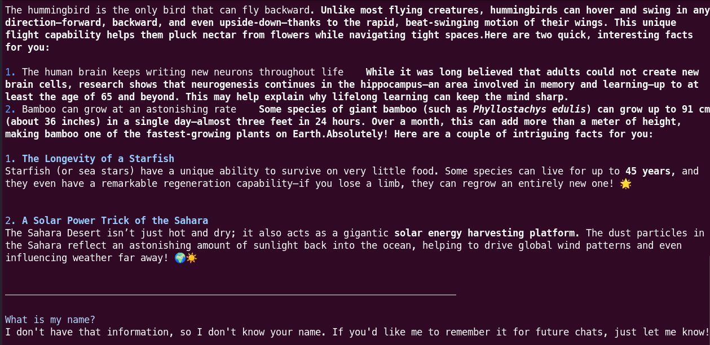

# AI Memory Illusion

Simple AI python script that shows how calls to LLM are stateless, that is, they do not hold proper `memory` of the conversation. That must be handled by the application code.

On the first call uncomment the line that add the user name to the chat and run the script. The LLM will infer the user name from the accumulated context window that always is provided when calling the API.

On the second call, keep it commented and run the script. The LLM will not be able to infer the user name from the accumulated context window.

## Setup

1. Install [uv](https://docs.astral.sh/uv/getting-started/installation/).
2. Run `uv sync`.
3. Copy `.env.example` and rename to `.env`.
3. Setup environment variables as:

|Name|type|Description|
|-|-|-|
|API_BASE_URL|url| The OpenAPI compatible endpoint for chat and tool calling.|
|API_KEY|text|The credential key to authenticate against the the api.|
|MODEL|text|The model name to be called from the api.|

## Use

1. Run `uv run --env-file=.env src/ai_memory_illusion/main.py`.

Example of response:

**With Memory**

**Without Memory**

